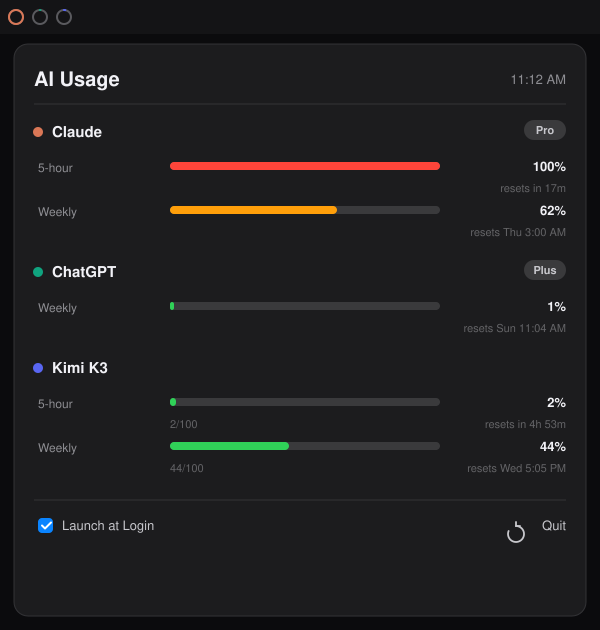

# QuotaBar

A lightweight macOS menu bar app that keeps your AI coding-assistant usage limits visible at a glance — **Claude**, **ChatGPT (Codex)**, and **Kimi K3**.



## Features

- **Menu bar rings** — three mini donut rings (orange = Claude, green = ChatGPT, blue = Kimi) that fill with each service's 5-hour-window usage
- **Detail panel** — click the rings for every usage window per service: percent used, progress bars, reset countdowns, and plan badges
- **Severity colors** — bars go green → orange → red as you approach a limit
- **Auto-refresh** every 5 minutes, plus manual refresh
- **Launch at Login** toggle built in
- **Zero configuration** — reuses the logins you already have from Claude Code, Codex CLI, and opencode. No API keys to paste, no accounts to create
- **Negligible battery impact** — three small HTTPS requests every 5 minutes, no polling loops or websockets

## Requirements

- macOS 14+
- Swift 6 toolchain (`xcode-select --install`)
- At least one of: Claude Code, Codex CLI, or opencode logged in

## Setup

```bash
git clone https://github.com/slandau3/QuotaBar.git
cd QuotaBar
./build.sh --install
```

This compiles a release binary, bundles `QuotaBar.app`, installs it to `/Applications`, and launches it. Look for the three rings in your menu bar.

**First launch:** macOS will ask whether QuotaBar may access the "Claude Code-credentials" Keychain item (needed to read Claude's OAuth token). Choose **Always Allow**.

## Where authentication comes from

QuotaBar never stores credentials of its own. It reads the tokens your existing tools already wrote to disk and calls each provider's own usage endpoint:

| Service | Auth source | How it got there | Usage endpoint |
|---|---|---|---|
| Claude | Keychain item `Claude Code-credentials` (`claudeAiOauth.accessToken`) | Logging in to Claude Code | `GET api.anthropic.com/api/oauth/usage` |
| ChatGPT | `~/.codex/auth.json` (`tokens.access_token` + `account_id`) | `codex login` | `GET chatgpt.com/backend-api/wham/usage` |
| Kimi K3 | `~/.local/share/opencode/auth.json` (`kimi-for-coding.key`) | `opencode auth login` | `GET api.kimi.com/coding/v1/usages` |

### Claude specifics

- The OAuth access token expires periodically. When it does, QuotaBar performs the standard OAuth refresh flow (Claude Code's public client ID) and **writes the rotated tokens back to the Keychain**, so Claude Code keeps working untouched.
- If the refresh token itself has expired, the panel shows *"Re-auth needed — run `claude` once."* Opening Claude Code re-creates the credentials and QuotaBar picks them up on the next refresh.
- The token must include the `user:profile` scope (standard for Claude Code logins).

### ChatGPT specifics

- The API returns whichever rate-limit windows are active for your account. The weekly window is always present; the 5-hour window appears on accounts/usage patterns where OpenAI exposes one. QuotaBar renders whatever the API returns.
- When a service has no 5-hour window, its menu bar ring falls back to that service's most relevant window (weekly) rather than sitting empty.

### Kimi specifics

- The 5-hour burst window and weekly quota both come from the single `/usages` response, along with request counts (`used/limit`).

## Privacy

Credentials are read locally, used only to call the provider's own API, and never logged or sent anywhere else. There is no telemetry, no analytics, and no third-party network calls.

## Development

```bash
swift build            # debug build
./build.sh             # release build + QuotaBar.app bundle (in repo dir)
./build.sh --install   # ...also installs to /Applications and relaunches
```

Layout:

```
Sources/
├── QuotaBarApp.swift   # @main app, MenuBarExtra, menu bar ring rendering
├── Models.swift        # Service, UsageWindow, ServiceUsage, formatting helpers
├── Providers.swift     # Claude / ChatGPT / Kimi fetchers (async, parallel)
├── UsageStore.swift    # @Observable store, 5-minute refresh loop
├── Keychain.swift      # Claude credential read/write (Security framework + CLI fallback)
└── Views.swift         # Dropdown panel UI
```

## License

MIT
